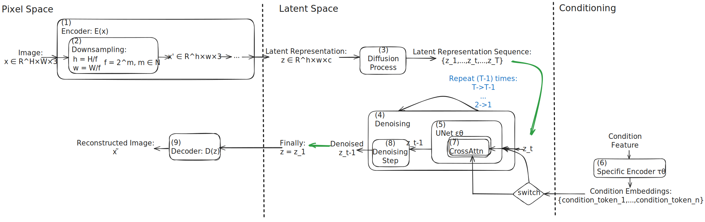
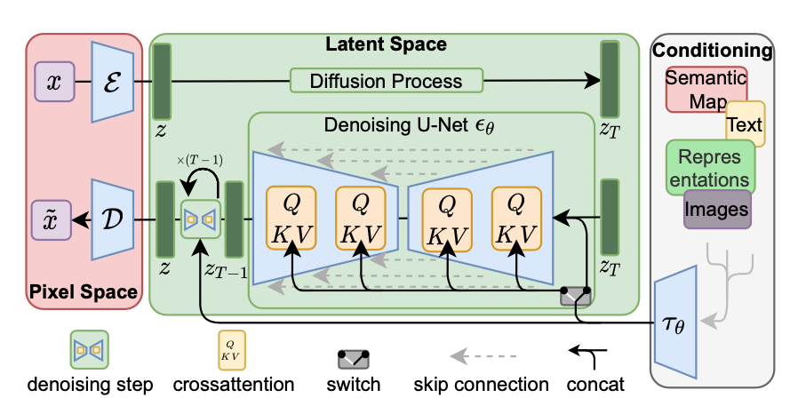

# Original Paper
[**paper**](stable_diffusion.pdf)

# Summarization
## Level 1: The Main Idea

**Keep in Mind**: Check whether - Did **Indeed Work** on **real-world problems**。

See `5` and `6`

#### 1. What is the problem?
Expensive taining (due to "operate directly in pixel space") and inference (due to sequential evaluations) consumptions of DMs.

#### 2. Why need to solve this problem?
**Computational Efficiency**: Enable DM training on limited computational resources.

#### 3. How is it different from prev.?
Apply DMs in **latent space** of ...

* An **autoencoder** for **low-diminutional latent space** representation learning - Reconstruction
	* A *Perceptual Equivalent* of prev.'s *perceptual compression* stage

* DM learn in latent space - Generation
	* Better *Scaling Properties* compared to those learn from *high-dimensional pixel space*
		* Q: Why "better scaling properties"?
		* A: When the image resolution increases from 512×512 to 1024×1024 (for example), the computational cost of LDMs increases relatively modestly and remains feasible (since generator learn in the **relatively low-dimensional** latent space -> **easier to learn** when resolution increasing).

#### 4. Why is it better than prev.? (Advantages)
- **More Efficient**: It allows to achieve trade-off(? near-optimal point) between complexity reduction and detail preservation.
	-  Complexity Reduction: 
		-  *Learned Latent Space* is *"Perceptual Equivalent"* of *Perceptual Compression* without *Excessive Downsampling*
		-  Generation inputs at *Low-Dimensional Latent Space* rather than *High-Dimensional Pixel Space*
	-  Detail Preservation: Using *Autoencoder* to generate latent space representation is *Perceptual Equivalent* of *Perceptual Compression* while *ignoring high-frequency, imperceptible details*
- **Retain Performance**: Enables general conditioning inputs (text & bounding boxes, etc) and high-resolution sythesis.

	- Better *Scaling Properties* (generator learn in latent space) compared to those learn from *high-dimensional pixel space*
	
	- Compared with *training an encoder/decoder architecture and a score-based prior simultaneously* (**one stage**):	
		- More stable training process: *No delicate weighting* of *reconstruction* and *generative* abilities
		- "**2-Stage** Separate Training" (Reconstruction+Generation): The autoencoder can focus on the reconstruction task without being disturbed by the generation task.
		- *Very little regularization* of the latent space

- On Diverse Tasks and More Flexible (also the supplements to **Retain Performance**):

	- For **Densely Conditioned** Tasks (super-resolution, inpainting, semantic synthesis, etc.): Could be applied in a *convolutional fashion* and render large -> But keep in mind, the convolutional neural network structure runs through the autoencoder part and UNet part.

	- For **Class-Conditional** Tasks (text-to-image, layout-to-image, etc.): A *general-purpose conditioning mechanism* based on *cross-attention*, enabling *multi-modal* training  -> (conditioning inputs (text & bounding boxes, etc))

	- **Unconditional** Image Generation Tasks

| | Densely Conditioned | Class-Conditional |
|-----------|-------------------|-------------------|
| **Definition** | **Pixel-level Correspondence**: The conditional information (input) and the output image have a close pixel-level correspondence in space. | **Global Semantics**: Conditional information provides global semantics or style guidance. |
| | **Structured Conditions**: The conditional input is usually structured data of the same size (or pixel-level magnification) as the output. | **Abstract Conditions**: Conditions are usually abstract information such as text, labels or layout. |
| | **Strong Local Constraints**: The generation of each pixel position is strongly constrained by the corresponding conditions | **More Creativity**: Greater freedom of generation under the constraints of conditions. |
| **Condition Density** | Pixel-level dense constraints | Global sparse constraints |
| **Spatial Correspondence** | Strong spatial correspondence | Weak spatial correspondence |
| **Generation Freedom** | Lower (fixed structure) | Higher (more creative) |
| **Task Difficulty** | Mainly detail reconstruction | Mainly semantic understanding |
| **Evaluation Method** | Pixel-level metrics dominant | Semantic consistency dominant |
| **Applications** | **Super-Resolution**: low-resolution image → high-resolution image (pixel-level magnification) | **Text-to-Image** (semantic guidance) |
|  | **Inpainting**: Image with mask → Complete image corresponded spatial position of input and output) | **Layout-to-Image**: layout box + category label → image (layout guidance) |
|  | **Semantic Synthesis**: semantic segmentation map → real image (corresponding to each pixel category) |  |

#### 5. What is the approach itself?
**Latent** DMs with **cross-attention** layers.

- Latent DMs: Autoencoder *Reconstructor* + DM *Generator*
- *Conditioning Mechanisms* based on *cross-attention*

#### 6. What are the applications of it?

**Efficient**:

- class-conditional image synthesis

- unconditional image generation (generated directly from *noise*, usually as a sub-step in the image synthesis process)
- densely conditioned generation:
	- image inpainting
	- super-resolution
- etc.

#### Comparison of Image Synthesis Models

| Model Type | Main Features | Pros | Cons | Best For |
|------------|---------------|------|------|----------|
| **AR Transformers** | - Billions of parameters <br> - Sequential generation | High-quality complex scenes | Extremely expensive computation | High-resolution synthesis |
| **GANs** | - Adversarial training <br> - Fast generation | Fast, sharp results | - Training instability <br> - Mode collapse <br> - Hard to modeling complex, multi-modal distributions | - Simple datasets (limited variability) <br> - Face generation |
| **Diffusion Models** | - Sequential denoising autoencoders <br> - Parameter sharing | - Stable training <br> - Versatile <br> - SOTA results | Slower than GANs | Most image synthesis tasks |

## Level 2: The Structure
#### Summarized Block-Diagram

```
PS: This is kind of like level 4 since including details of implementation.
```
#### Summarized Block-Diagram (Simplified, but  Generally Should Be Like This)
ToDo
#### Original in Paper

## Level 3: The Most Important Details
```
PS: This is kind of like level 4 since including details of implementation.
```

### Track Down Central Citations (fr Papers, Supplement Materials and Source Codes) and Follow Each Step of Author's (Main) Contribution
### 1. UNet
#### UNet Block

```
Unified UNet Block = {
    - Conv Layer: Conv2D
    - Norm Layer: BatchNorm/GroupNorm/LayerNorm/etc. 
    - Activation: ReLU/SiLU/GELU/etc.
    - Attention Mechanism: Self-Attention/Cross-Attention
    - Residual Connection
}

Encoder Unet Block (generally) = {
	- Conv Layer: Conv2D
   	- Norm Layer: BatchNorm/GroupNorm/LayerNorm/etc. 
   	- Activation: ReLU/SiLU/GELU/etc.
} i.e. Downsample Block

Decoder Unet Block (generally) = {
	- Transposed Conv2D/Interpolation
	- Conv Layer: Conv2D
} i.e. Upsample Block
```
#### Special Design of UNet in Stable Diffusion
There 2 types of block - `ResNet Block` and `Attention Block`

```
ResNet Block:
Input → Conv → Norm → Activation → Conv → Norm → Add → Output
  ↓                                               ↑
  └─────────────── Skip Connection ───────────────┘

Attention Block = {
	- Attention Mechanism: Self-Attention/Cross-Attention
}
```
```
ResNet (2015)

Input x → [Conv → ReLU → Conv] → Add → Output
    ↓                             ↑
    └────── Identity Mapping ─────┘
    
- Purpose: To solve the gradient disappearance problem of deep networks
- element-wise addition
```
```
Skip Connection in UNet (2015)

Encoder Features → [Bottleneck] → Decoder → Concat → Output
       ↓                                      ↑
       └────────── Skip Connection ───────────┘

- Purpose: Maintain spatial detail information
- channel-wise concatenation
```
example of UNet:

```
Encoder:
  Resolution Level 1 (64×64): ResNet + ResNet + CrossAttn  # i=1
  Resolution Level 2 (32×32): ResNet + ResNet + CrossAttn  # i=2
  Resolution Level 3 (16×16): ResNet + ResNet + CrossAttn  # i=3

Bottleneck:
  Level 4 (8×8):   ResNet + CrossAttn + ResNet  # i=4

Decoder:
  Resolution Level 3 (16×16): ResNet + CrossAttn + ResNet  # i=3  
  Resolution Level 2 (32×32): ResNet + CrossAttn + ResNet  # i=2
  Resolution Level 1 (64×64): ResNet + CrossAttn + ResNet  # i=1
```
#### Whole Architecture
So, the whole architecture of UNet may seems like following:

```
Encoder                    Decoder
Input                      Output
  ↓                          ↑
Block1 ─────────────────→ Block1'
  ↓           skip           ↑
Block2 ─────────────────→ Block2'  
  ↓           conn           ↑
Block3 ─────────────────→ Block3'
  ↓                          ↑
  └─────── Bottleneck ───────┘

e.g.
Resolution Level 1: 256×256×64  ────────→ 256×256×64
Resolution Level 2: 128×128×128 ────────→ 128×128×128  
Resolution Level 3: 64×64×256   ────────→ 64×64×256
Resolution Level 4: 32×32×512   ────────→ 32×32×512
                        ↓                    ↑
                        Bottleneck: 16×16×1024
```
For Python Pseudocode

```Python
# Encoder Period - Store Feature
encoder_features = []
x = input_image
for encoder_block in encoder_blocks:
    x = encoder_block(x) # i.e. φ_i
    encoder_features.append(x)  # stored for skip connection
    x = downsample(x)

# Bottleneck
x = bottleneck(x) # i.e. φ_N (The Level N+1 is the bottleneck-level, since i start from 0, current idx is N)

# Decoder Period - Use skip connections
for i, decoder_block in enumerate(decoder_blocks):
    x = upsample(x)
    skip_feat = encoder_features[-(i+1)]  # Encoder Feature of corresponding level
    x = concat([x, skip_feat], dim=channel)  # concat
    x = decoder_block(x) # i.e. φ_N-i-1, N is the total-cnt of resolution levels

```
### 2. Cross-Attention Based Conditioning Mechanism
Cross-Attention in each resolution level:

```Python
class UNetResolutionLevel(nn.Module):
    def forward(self, x, text_condition):
        # x: (B, C, H, W) feature of current resolution level
        
        # ResNet blocks processing
        for resnet_block in self.resnet_blocks:
            x = resnet_block(x, timestep) # i.e. φ_i
        
        # Cross-attention applied in current resolution level
        x_attended = self.cross_attention(
            query=torch.matmul(x, W_Q_i),          
            key=torch.matmul(text_condition, W_K_i),   
            value=torch.matmul(text_condition, W_V_i)
        )
        
        x = x + x_attended  # condition infused
        
        return x 
```
[A simple implementation of a cross-attention in UNet](stable_diffusion/cross_attention.py)

The whole UNet feed-forward:

```Python
def unet_forward(x, text_condition, timestep):
    # Encoder
    encoder_features = []
    
    # 64x64 -> 32x32 -> 16x16 -> 8x8
    for level_i, encoder_level in enumerate(encoder_levels):
        x = encoder_level(x, text_condition, timestep)  # cross-attention within it
        encoder_features.append(x)  
        x = downsample(x)
    
    # Bottleneck (8x8)
    x = bottleneck(x, text_condition, timestep) # cross-attention within it
    
    # Decoder
    # 8x8 -> 16x16 -> 32x32 -> 64x64
    for level_i, decoder_level in enumerate(decoder_levels):
        x = upsample(x)
        skip_feat = encoder_features[-(level_i+1)]
        x = torch.cat([x, skip_feat], dim=1)  # skip connection
        x = decoder_level(x, text_condition, timestep)  # cross-attention within it
    
    return x  

```
How is condition passed to output?

```
Input Noise → Encoder → Bottleneck → Decoder → Output Image
            	↑           ↑          ↑
        	Cross-Attn  Cross-Attn  Cross-Attn
            	↑           ↑          ↑
        	Condition   Condition    Condition
```
### 3. Complete Denoising Cycle
```Python
# T full UNet feed-forward passes
z = z_T  # initial noise
for t in range(T, 0, -1):  # T, T-1, T-2, ..., 1
    # A full UNet feed-forward pass is required at each time step t
    predicted_noise = unet(z, t, condition)  # complete feed-forward pass
    z = scheduler_step(z, predicted_noise, t)  # denoising update
    
final_result = z_0
```
### 4. Switch
#### Concatenation Condition Infusion
```Python
z_conditioned = torch.cat([z_t, condition], dim=channel)
output = unet(z_conditioned, t)
```
- More suitable for **image conditions** (**spatial corresponding**)

#### Cross-Attention Condition Infusion
```Python
output = unet(z_t, t, text_condition=τθ(y))
```
- More suitable for **text conditions** (**semantic corresponding**)

### For Results Section
#### 1. Do the results justify the method?
#### 2. Are there cases/scenarios that should have been tested but weren’t?
#### 3. Is the complexity of the method justified (in terms of some quantifiable metric) by its advantages over other methods that may be simpler or easier to use?
#### 4. Where does the method fail?

## Level 4: The Other Details
### 1. Tokenization of z\_t to visual tokens
```
[batches, channel, height, width] -tokenization: split into patches-> [patches, visual_tokens]

Each patch, i.e. [visual_tokens]
					\
						-> CrossAttn -> Output of each patch 
					/
Conditon embeddings, i.e. [condition_tokens]

if:
	visual_tokens = m
	condition_tokens = n
then:
	output of each CrossAttn = 
			[[softmax(q1k1)v1/√d+...+softmax(q1kn)vn/√d],
			 ...
			 [softmax(qmk1)v1/√d+...+softmax(qmkn)vn/√d]]
			 
if:
	patches = k
then:
	k times cross-attn
	k [m_dimension]-output
	some aggregation (eg. concatenate) -> One Overall Output of this level
```