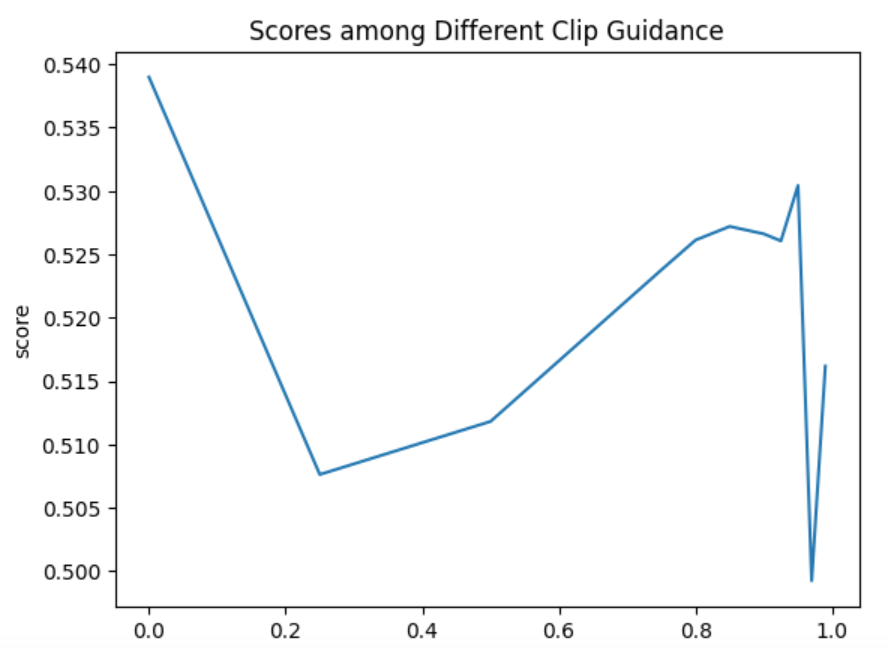

### Exp-1
Param:

- No Progressive Guidance

```Python
prompt = (
    f"clean classic vector illustration of {description}, "
    "flat design, solid colors only, minimalist, simple shapes, "
    "geometric style, flat color blocks, minimal details, no complex details"
)

# "lines, framing, hatching, background, patterns, outlines, "
negative_prompt = (
    "photo, realistic, 3d, noisy, textures, blurry, shadow, "
    "gradient, complex details, patterns, stripes, dots, "
    "repetitive elements, small details, intricate designs, "
    "busy composition, cluttered"
)

seed = 42
device = "cuda:0"

img, svg = generate_svg_with_guidance(
    prompt=prompt,
    negative_prompt=negative_prompt,
    description=description,
    device=device,
    # --- Strength parameter for blending structured and random noise ---
    strength=1.0, # 1.0 is pure noise, 0.0 is pure structure
    num_inference_steps=15,
    guidance_scale=20,
    vector_guidance_scale=4.5,
    # ToDo: parameter adjustment
    lpips_mse_lambda=0.1, 
    clip_guidance_scale=0.0, 
    # ToDo-End: parameter adjustment
    guidance_start_step=0,
    guidance_end_step=15,
    guidance_resolution=1024,
    guidance_interval=1,
    seed=42,
    use_half_precision=True,
    enable_sequential_cpu_offload=True,
    low_vram_shift_to_cpu=False
)
```

```
clip_guidance_scale: 0.0
score: 0.5389758799109624
clip_guidance_scale: 0.25
score: 0.5076237391672697
clip_guidance_scale: 0.50
score: 0.5118086584020818
clip_guidance_scale: 0.75
score: 0.5237646509131556
clip_guidance_scale: 0.80
score: 0.5261173600778374
clip_guidance_scale: 0.85
score: 0.5271939252389335
clip_guidance_scale: 0.90
score: 0.5266083447264027
clip_guidance_scale: 0.925
score: 0.5260514216904597
clip_guidance_scale: 0.95
score: 0.5304227564028253
clip_guidance_scale: 0.97
score: 0.49924003005101464
clip_guidance_scale: 0.99
score: 0.516175245000283
```

```Python
import matplotlib.pyplot as plt

x = [0.0, 0.25, 0.50, 0.75, 0.80, 0.85, 0.90, 0.925, 0.95, 0.97, 0.99]
y = [0.5389758799109624, 0.5076237391672697, 0.5118086584020818, 0.5237646509131556, 0.5261173600778374, 0.5271939252389335, 0.5266083447264027, 0.5260514216904597, 0.5304227564028253, 0.49924003005101464, 0.516175245000283]

plt.plot(x, y)

plt.title("Scores among Different Clip Guidance")
plt.xlabel("clip_guidance_scale")
plt.ylabel("score")

plt.show()
```



### Exp-2
Param:

```Python
def get_progressive_guidance_config(current_step: int, total_steps: int) -> dict:
    
    progress = current_step / total_steps
    
    if progress < 0.15:
        current_clip_scale = 0.0
        
    elif progress < 0.50:
        current_clip_scale = (progress - 0.15) / (0.50 - 0.15)
        
    elif progress < 0.90:
        progress_in_decay = (progress - 0.50) / (0.90 - 0.50)
        current_clip_scale = 0.5 * (1 + np.cos(np.pi * progress_in_decay))
        
    else:
        current_clip_scale = 0.0
        
    return {'clip_weight': current_clip_scale}
```

```
clip_guidance_scale: 2.0
score: 0.5340815041469475
clip_guidance_scale: 1.75
score: 0.5056460312888853
clip_guidance_scale: 1.5
score: 0.5561520871238944
clip_guidance_scale: 1.25
score: 0.523435648367369
clip_guidance_scale: 1.0 
score: 0.539850
clip_guidance_scale: 0.9
score: 0.5164388817232468
clip_guidance_scale: 0.8
score: 0.496268
clip_guidance_scale: 0.75
score: 0.5269537721773204
```

### Exp-3
Param:

```Python
soften_augment_transforms = transforms.Compose([
    transforms.RandomAffine(degrees=5, translate=(0.05, 0.05), scale=(0.95, 1.05)),
    transforms.GaussianBlur(kernel_size=5, sigma=(0.1, 1.5)),
])

softened_svg_for_clip = soften_augment_transforms(rendered_svg_tensor)

noise_level = 0.03 
noise = torch.randn_like(softened_svg_for_clip) * noise_level
softened_svg_for_clip = (softened_svg_for_clip + noise).clamp(0, 1)

clip_image_input = clip_processor(images=softened_svg_for_clip.to(guidance_device), return_tensors="pt").to(guidance_device)
```

```
clip_guidance_scale: 1.2
score: 0.5373669282633808
clip_guidance_scale: 1.1
score: 0.5503305679653343
clip_guidance_scale: 1.05
score: 0.5331958366985344
clip_guidance_scale: 1.0 
score: 0.547210581620149
clip_guidance_scale: 0.9
score: 0.5192569744535819
clip_guidance_scale: 0.8
score: 0.5428703067257127
```